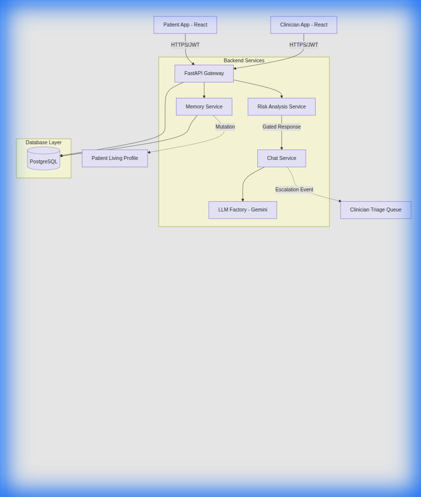
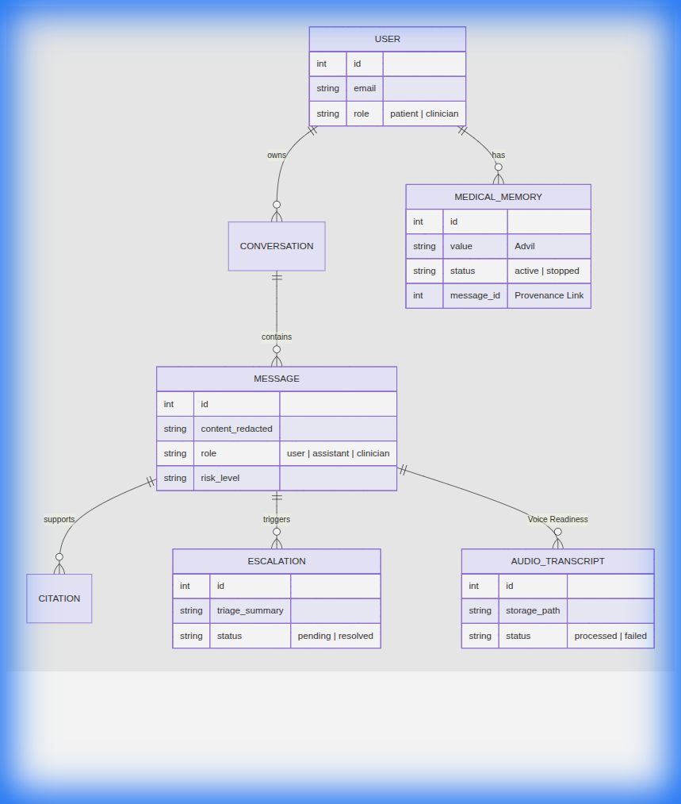

# Technical Brief: Nightingale Medical Messaging System

## 1. Architecture Overview

The Nightingale system is built as a **Secure, AI-Gated Healthcare Messaging Platform**. It employs a "Safety-First" architecture where every interaction is validated for medical risk before reaching the patient.

### Key Architectural Pillars:
- **Risk-Gated Pipeline**: Every incoming message passes through `RiskAnalysisService` before any AI advice is generated. If "Med" or "High" risk is detected, the AI is short-circuited.
- **Background Extraction**: Memory mutation (extracting facts like medications) happens asynchronously via background tasks to ensure sub-second response latency for the patient.
- **Clinician-in-the-Loop**: The "Escalation Loop" ensures that AI never operates in a vacuum for critical cases.

---

## 2. Data Schema

The schema is designed for **Medical Provenance**. Every extracted fact must point back to the specific message that generated it.

---

## 3. First-Principles Thinking & Assumptions

1. **Safety Over Fluency**: It is better for the AI to refuse to answer a high-risk question than to give a hallucinated diagnosis.
2. **Provenance is Trust**: In a clinical setting, a fact (e.g., "Allergic to Penicillin") is useless without knowing *who* said it and *when*.
3. **Privacy by Design**: PHI (Patient Health Information) like NRIC or Phone numbers should never enter the LLM's context window. Redaction happens at the edge (Backend API).
4. **Empower, Don't Replace**: The AI is a triage assistant and educator, not a doctor. Every interaction ends with a nudge toward professional consultation.

---

## 4. Trade-offs & Scope

### What was prioritized:
- **The "Safety Stop"**: Ensuring high-risk symptoms (like chest pain) immediately disable AI and alert the clinic.
- **Living Memory**: Implementing the logic that handles "I take X" vs "Actually I stopped X" correctly within a single session.
- **Clinician Ground Truth**: Ensuring that when a nurse replies, that message is marked as "Verified" and used to ground future AI responses.

### What was cut (Out of Scope):
- **LLM Fine-tuning**: Due to the 48-hour build constraint, I opted for rigorous **Prompt Engineering** over fine-tuning with custom datasets. This ensured the LLM followed medical safety guardrails without the latency of training or complex data preparation.
- **Complex Clinician Roster**: In this MVP, all clinicians see a global triage queue. In production, this would be scoped to specific clinics/specialties.
- **Full E2E Encryption**: While TLS is used, the backend still processes text to perform redaction and extraction. A future iteration might use Trusted Execution Environments (TEEs).

---

## 5. VoiceAI Strategy

Nightingale is "Voice-Ready" by design. Here is how audio slots into the current schema:

1. **Schema Support**: The `Message` table includes an optional `audio_id` and `transcript_id`.
2. **Ingestion Flow**: 
   - Patient records audio in the Frontend.
   - The `.wav` file is uploaded to secure object storage (e.g., S3/GCS).
   - An asynchronous STT (Speech-to-Text) service processes the audio.
   - The resulting text is fed into the same `RiskAnalysisService` and `MemoryService` pipeline.
3. **Grounding**: The `MEDICAL_MEMORY` provenance link would point to the transcript, and the UI would allow the clinician to "Play Original Audio" to verify intent/tone (e.g., slurred speech as a symptom).
